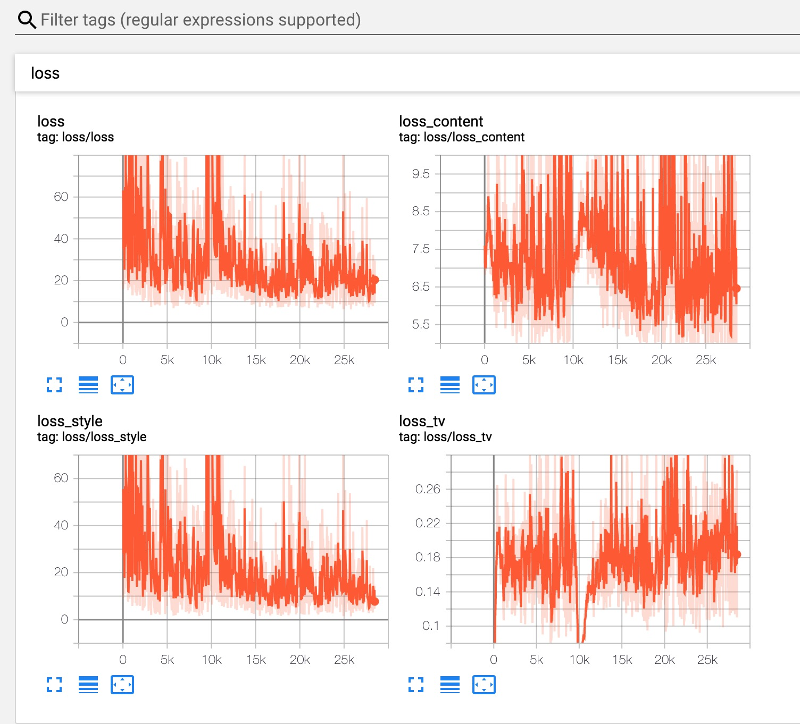
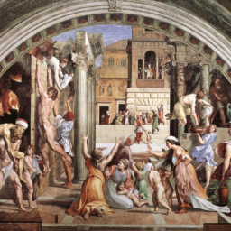
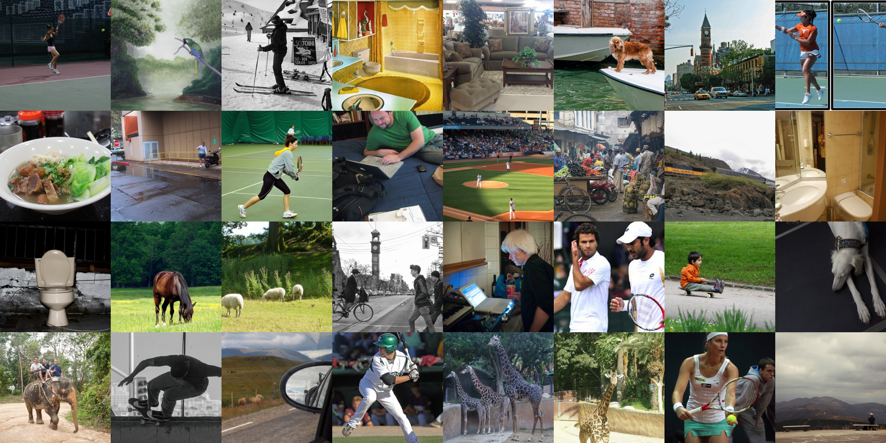
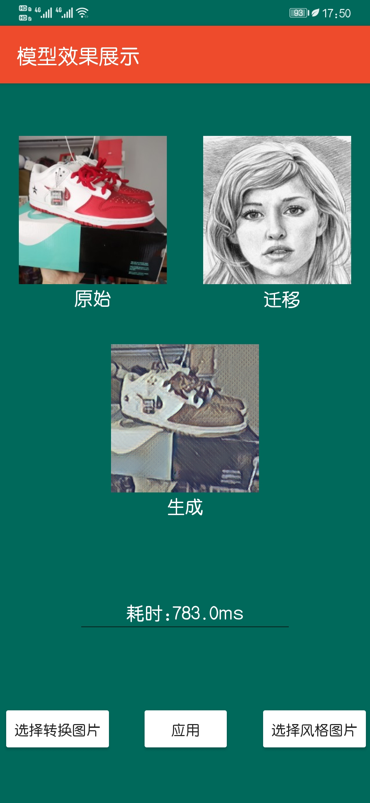
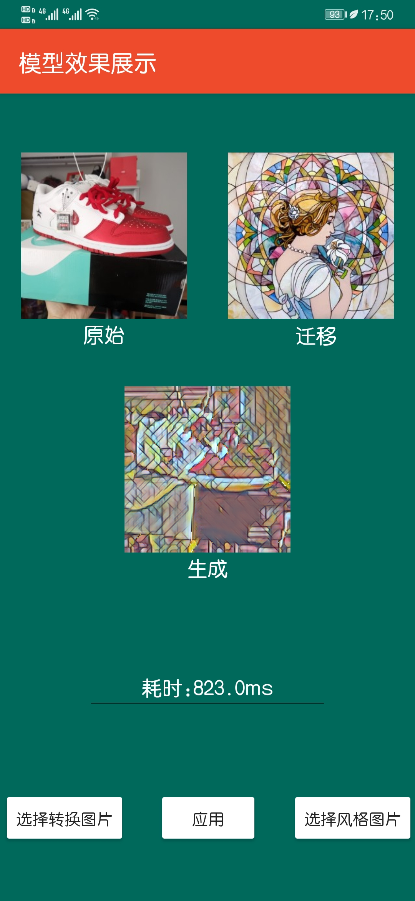
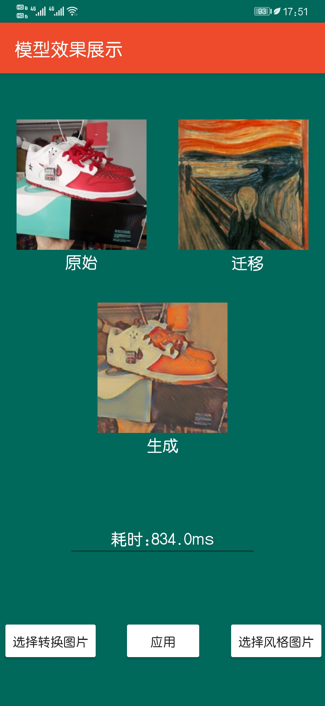

# Multi Style Transfer
使用pytorch对论文《Multi-style Generative Network for Real-time Transfer》的复现

分别使用COCO和[WikiArt](https://www.kaggle.com/c/painter-by-numbers/data)

# Below picture shows the training-process on tensorboard:

# Destination Style Image:

# Original Content Images:

# Result:

后面试了下pytorch mobile，模型没有经过任何其他优化，直接使用torch.jit.trace生成.pt，丢进android里，速度比较慢。
# Result:

### Acknowledgement
The code benefits from outstanding prior work and their implementations including:
- [Multi-style Generative Network for Real-time Transfer](https://arxiv.org/pdf/1703.06953.pdf) by Ulyanov *et al. ICML 2016*. ([code](https://github.com/zhanghang1989/PyTorch-Multi-Style-Transfer))

